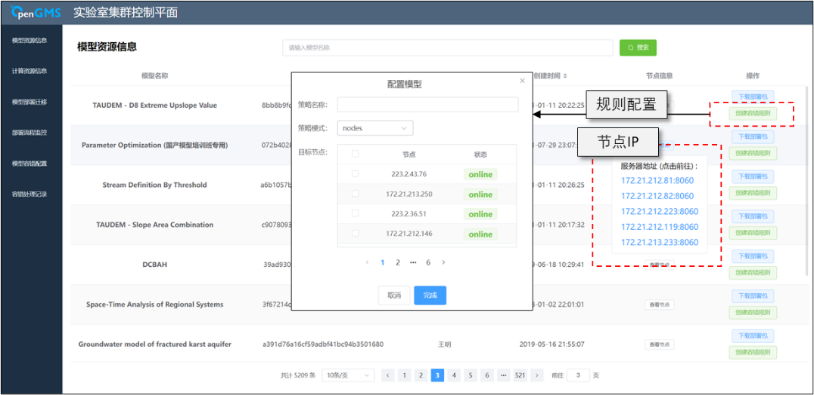

# ControlPlane

## 介绍
针对私有集群下模拟过程中所面临的模型管理相关需求，设计面向私有集群的模型控制平面（提供自动化部署、迁移和容错处理等功能的私有集群管理平台）基础架构，为组织机构已有的集群架构模式提供轻量化管理方案，并以模型服务化调用的方式供模型使用者使用。

## 项目架构

------

## 功能模块

## 系统截图
**模型资源信息界面**
 

**计算资源信息界面**
 

**模型部署迁移界面**
 

**部署流程监控界面**
 

**容错配置界面**
 

**容错处理记录**
 
